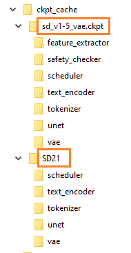

# Download and setup base models

In order to train, you need a base model on which to train.  This is a one-time setup to configure base models when you want to use a particular base.

Make sure the trainer is installed properly first. See [SETUP.md](SETUP.md) for more details. 

When you finish you should see something like this, come back to reference this picture as you go through the steps below:

 *(this picture is just an EXAMPLE)*

## Download models

You need some sort of base model to start training.  I suggest these two:

Stable Diffusion 1.5 with improved VAE:

https://huggingface.co/panopstor/EveryDream/blob/main/sd_v1-5_vae.ckpt

SD2.1 768:

https://huggingface.co/stabilityai/stable-diffusion-2-1/blob/main/v2-1_768-nonema-pruned.ckpt

You can use SD2.0 512 as well, but typically SD1.5 is going to be better.

https://huggingface.co/stabilityai/stable-diffusion-2-base/blob/main/512-base-ema.ckpt

Place these in the root folder of EveryDream2.

Run these commands *one time* to prepare them. **It's very important to use the correct YAML!**

For SD1.x models, use this (note it will spill a lot of warnings to the console, but its fine):

    python utils/convert_original_stable_diffusion_to_diffusers.py --scheduler_type ddim ^
    --original_config_file v1-inference.yaml ^
    --image_size 512 ^
    --checkpoint_path sd_v1-5_vae.ckpt ^
    --prediction_type epsilon ^
    --upcast_attn False ^
    --dump_path "ckpt_cache/sd_v1-5_vae"

And the SD2.1 768 model (uses v2-v yaml and "v_prediction" prediction type):

    python utils/convert_original_stable_diffusion_to_diffusers.py --scheduler_type ddim ^
    --original_config_file v2-inference-v.yaml ^
    --image_size 768 ^
    --checkpoint_path v2-1_768-nonema-pruned.ckpt ^
    --prediction_type v_prediction ^
    --upcast_attn False ^
    --dump_path "ckpt_cache/v2-1_768-nonema-pruned"

And finally the SD2.0 512 base model (generally not recommended base model):

    python utils/convert_original_stable_diffusion_to_diffusers.py --scheduler_type ddim ^
    --original_config_file v2-inference.yaml ^
    --image_size 512 ^
    --checkpoint_path 512-base-ema.ckpt ^
    --prediction_type epsilon ^
    --upcast_attn False ^
    --dump_path "ckpt_cache/512-base-ema"

If you have other models, you need to know the base model that was used for them, **in particular use the correct yaml (original_config_file) or it will not properly convert.** Make sure to put some sort of name in the dump_path after "ckpt_cache/" so you can reference it later.

All of the above is one time.  After running, you will use --resume_ckpt and just name the file without "ckpt_cache/"

ex.

    python train.py --resume_ckpt "sd_v1-5_vae" ...
    python train.py --resume_ckpt "v2-1_768-ema-pruned" ...
    python train.py --resume_ckpt "512-base-ema" ...

