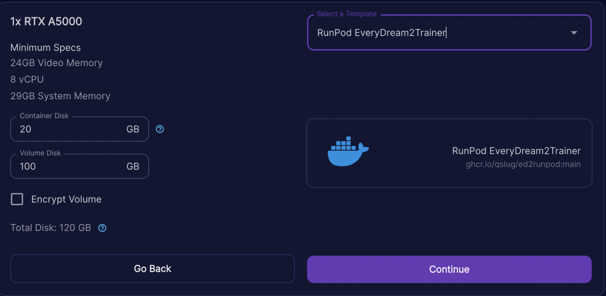
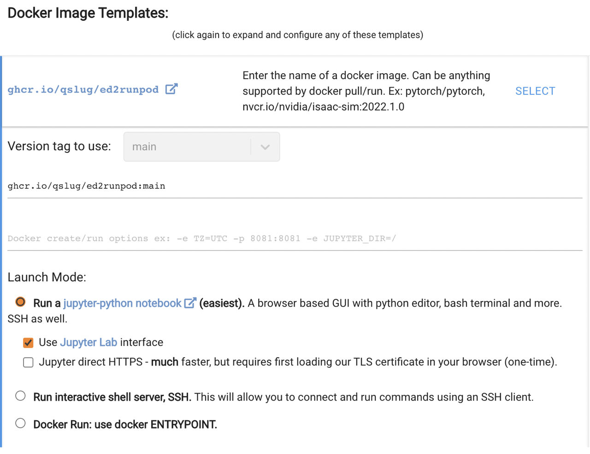

# RunPod
The simplest approach for RunPod is to use the [EveryDream2 template](https://runpod.io/gsc?template=d1v63jb36t&ref=bbp9dh8x) to load a fully configured docker image.

When opening JupyterLab [Port 8888] you will be prompted for a password. The default password is `EveryDream`.

# Vast
The RunPod EveryDream2 docker image is also compatible with [vast.ai](https://console.vast.ai/), and does not require a JupyterLab password.

# Once your instance is up and running
Run the `EveryDream2trainer/Train_JupyterLab.ipynb` notebook