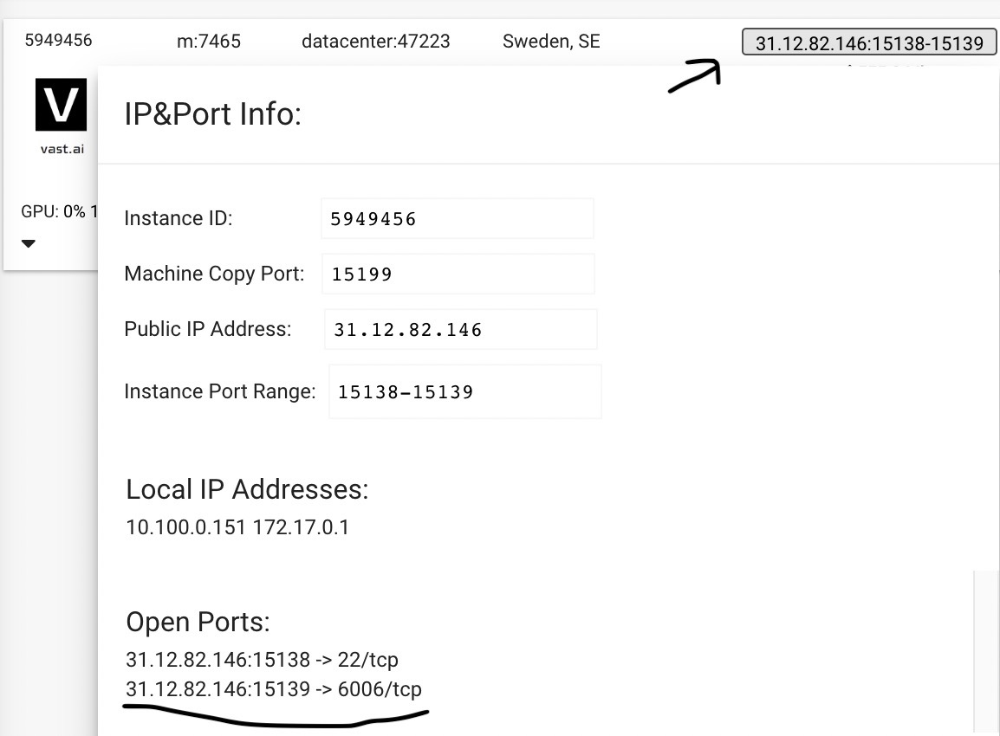

# RunPod
The simplest approach for RunPod is to use the [EveryDream2 template](https://runpod.io/gsc?template=d1v63jb36t&ref=bbp9dh8x) to load a fully configured docker image.

## JupyterLab
JupterLab will run on the pod by default. When opening JupyterLab `[Port 8888]` you will be prompted for a password. The default password is `EveryDream`. This can be changed by editing the pod's environment variables.

## SSH
You can also [enable full SSH support](https://www.runpod.io/blog/how-to-achieve-true-ssh-on-runpod) by setting the PUBLIC_KEY environment variable

## Tensorboard
Tensorboard will run automatically, and can be viewed on `[Port 6006]`

# Vast
The EveryDream2 docker image is also compatible with [vast.ai](https://console.vast.ai/).

`ghcr.io/victorchall/everydream2trainer:main`

## JupyterLab
You can enable JupyterLab as part of the Vast.ai instance configuration. No JupyterLab password is required. 

## Tensorboard
You can specify tensorboard to run at startup as part of your instance config.

Open the tensorboard port via docker 
```tensorboard --logdir /workspace/EveryDream2trainer/logs --host 0.0.0.0 &```



# Once your instance is up and running
Run the `Train_JupyterLab.ipynb` notebook