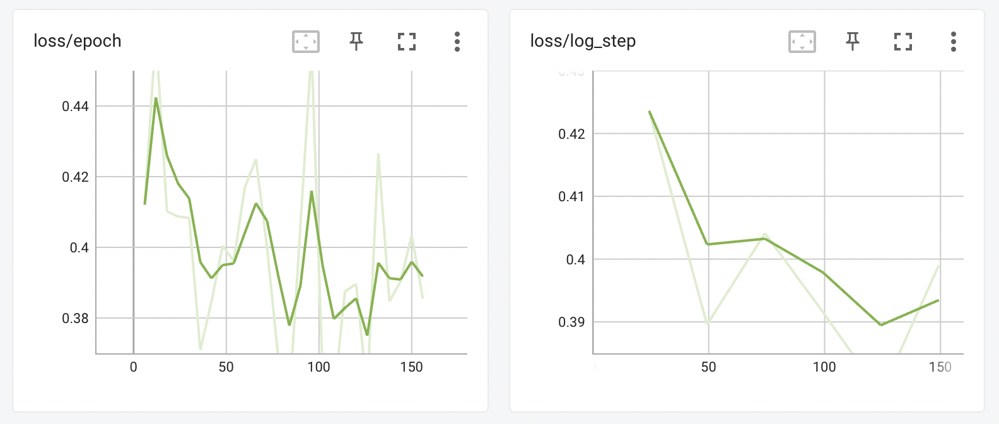
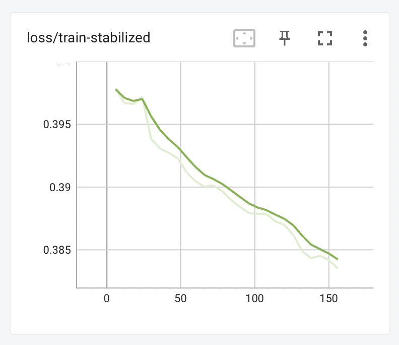
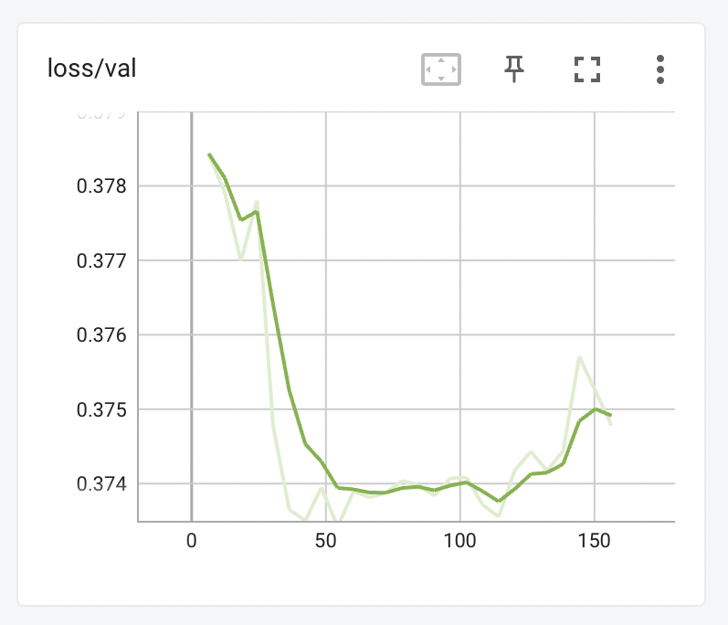
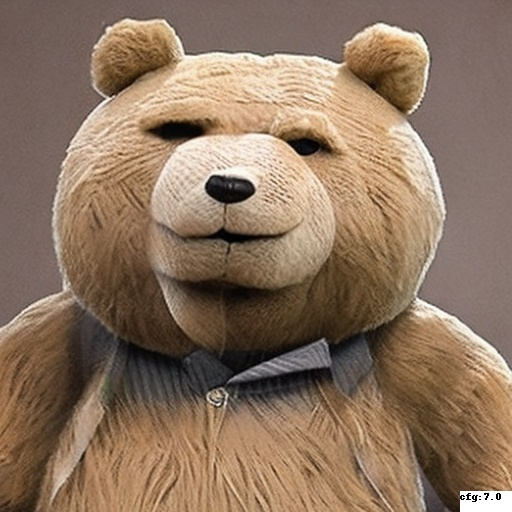
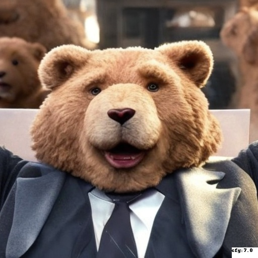
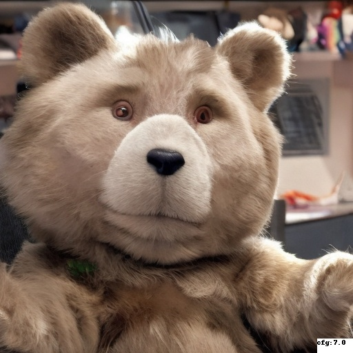
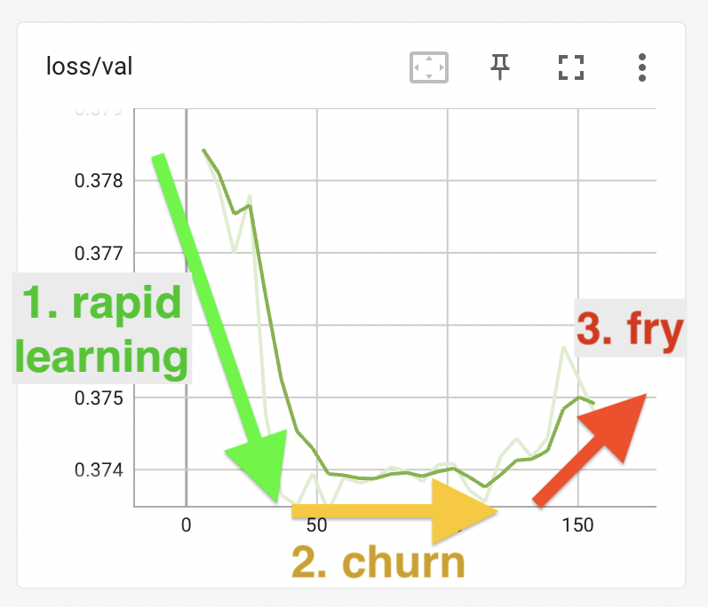

# Validation

*This documentation is incomplete.  Please feel free to contribute to it.*

To evaluate your training progress, EveryDream2 has a Validation feature that acts like an independent check about how well the training is generalising from the training data, vs how much it is just learning to reproduce the training data ("overfitting").

To do this, your data is split into `val` and `train` sets of captioned images. Training proceeds is done as normal using only the captioned images in the `train` dataset. At regular intervals (usually at the end of every epoch but you can adjust this in your [validation config file](#how-to-configure-validation)) the `val` dataset will be run through the model, producing a "loss" value that shows how well the model can apply what it has learnt to data that it was not trained on. 

The validation system also offers a way to "stabilize" the training loss. You may be already used to seeing loss graphs like this on Tensorboard or wandb:

With `stabilize_training_loss` set to `true` in your `validation_config.json` file, you will also see the following graph, taken from the same training session:

This graph shows a model that is very steadily learning from its training data, trending nicely and clearly downwards in a way that is not visible from `loss/epoch` or `loss/log_step`.

## How does Validation Help?

Validation does require that you sacrifice some of your dataset (by default, about 15% of it) and you may be asking, "what do I get for that?". What you get is a way of seeing an estimate about the state of a training run at a glance. I'll explain how using the following graph. Like the other graphs on this page, this was taken from a real training session with the Ted Bennett dataset. 

The training proceeds rapidly over the first 50 steps, with the model quickly getting better at applying what it has learnt from the `train` dataset to the `val` dataset. At this point, however it levels off, and stays flat for another 75 steps, before starting to rise until the training was stopped just after step 150. 

> Note that **the learning rate in this example is almost certainly too high**. Your graph should take much longer than 50 steps to reach the second "churn" phase. If you find it is rapidly plataeuing like the graph above, dial down the learning rate. 

### Training phases

The three parts of this graph - the fall, the flat part, and the rise - represent three phases of training the model. 

**In the first phase**, the model quickly learns how to generate images of a bear that looks roughly like Ted Bennett: 

| step 5                                                                                                                            | step 17                                                                                                                 | step 29                                                                                                                 | step 41                                                                                                                 | step 53                                                                                                                 | 
|-----------------------------------------------------------------------------------------------------------------------------------|-------------------------------------------------------------------------------------------------------------------------|-------------------------------------------------------------------------------------------------------------------------|-------------------------------------------------------------------------------------------------------------------------|-------------------------------------------------------------------------------------------------------------------------|
|  |  |  |  |  |

(In all of these images the prompt is `ted bennett in a grey suit and tie with his arms spread out`.)

**In the second phase**, the model is what I call "churning" - it is no longer learning a lot of new information, but is instead circling around the optimal position. Although the loss is no longer substantially decreasing, the model might still be learning new information. 

| step 65                                                                                                                 | step 77                                                                                                                 | step 89                                                                                                                 | step 101                                                                                                                | step 113                                                                                                                |
|-------------------------------------------------------------------------------------------------------------------------|-------------------------------------------------------------------------------------------------------------------------|-------------------------------------------------------------------------------------------------------------------------|-------------------------------------------------------------------------------------------------------------------------|-------------------------------------------------------------------------------------------------------------------------|
|  |  |  |  |  |

It looks as if the result at step 89 might be the best representation of Ted Bennett, but to confirm you would need to generate a lot more samples with different prompts and seeds.

**In the third phase**, the model is starting to overfit: edges start to get a bit weird, the saturation becomes stronger; everything feels a whole lot more *intense* somehow:

| step 125                                                                                                                | step 137                                                                                                                | step 149                                                                                                                | step 161                                                                                                                | step 173                                                                                                                |
|-------------------------------------------------------------------------------------------------------------------------|-------------------------------------------------------------------------------------------------------------------------|-------------------------------------------------------------------------------------------------------------------------|-------------------------------------------------------------------------------------------------------------------------|-------------------------------------------------------------------------------------------------------------------------|
|  |  |  |  |  |

When the model starts looking like this that means you've gone past the best point and it's time to stop. Normally you would detect this point by watching the outputs, but you can also watch the `loss/val` graph and try and stop the training before it starts to become unstable or trend upward. 

**Here's the loss graph again, with the training phases indicated**:

## Validation vs training losses

Here are the `train-stabilized` and `loss` graphs again: 

| train-stabilized                                                   | val                                                    |
|--------------------------------------------------------------------|--------------------------------------------------------|
|  |  |

Once again, these are taken from a real training run with the Ted Bennett dataset - the same run that produced the images above. You can see that although the `train-stabilized` graph tracks steadily downwards, and looks as though it's doing the right thing constantly, the `val` graph tells a different story. The shape of the val graph can show you in a compact way just where your training is. 

The best time to stop training is some time in the flat area after the easy learning has completed - on the graphs above, somewhere between step 50 and around step 125. It might be best to stop before step 100, or it could be better to give it a few more rounds and stop at step 125. To know for sure you'd need to look at more sample outputs and ideally try out the trained model in your web UI of choice. 

Because the flat "churn" period may be very long, it can be hard to tell when you're about to start "frying" your output. Becoming familiar with how the validation curve looks with your model will help. Try different learning rates and see how the training responds - you may find you want to dial the learning rate back a bit, so that the `val` graph looks more like the `train-stabilized` graph. Or you may find your dataset needs to be given a sharp kick at the start and then left to churn for a while. Try out different values, compare the graph to the results -- and please share your findings with me @damian0815 on the EveryDream discord, I'd be very happy to incorporate anything you find into this documentation.

## How to configure validation

`train.py` has a `validation_config` option that can be set either as a CLI argument or in the config file. To enable validation, set this option to the path to a JSON file containing validation options. There is a default validation file `validation_default.json` in the repo root, but it is not used unless you specify it.  

CLI use:

    --validation_config validation_default.json

or in a config file:

    "validation_config": "validation_default.json"

### Validation config settings

The config file has the following options:

#### Validation settings
* `validate_training`: If `true`, validate the training using a separate set of image/caption pairs, and log the results as `loss/val`. The curve will trend downwards as the model trains, then flatten and start to trend upwards as effective training finishes and the model begins to overfit the training data. Very useful for preventing overfitting, for checking if your learning rate is too low or too high, and for deciding when to stop training.
* `val_split_mode`: Either `automatic` or `manual`, ignored if validate_training is false. 
  * `automatic` val_split_mode picks a random subset of the training set (the number of items is controlled by `val_split_proportion`) and removes them from training to use as a validation set. 
  * `manual` val_split_mode lets you provide your own folder of validation items (images and captions), specified using `val_data_root`.
* `val_split_proportion`: For `automatic` val_split_mode, how much of the train dataset that should be removed to use for validation. Typical values are 0.15-0.2 (15-20% of the total dataset). Higher is more accurate but slower.
* `val_data_root`: For `manual` val_split_mode, the path to a folder containing validation items.

#### Train loss graph stabilization settings

* `stabilize_training_loss`: If `true`, re-evaluate the training loss normally logged as `loss/epoch` and `loss/log step` using a fixed random seed and log the results as `loss/train-stabilized`. This more clearly shows the training progress, but it is not enough alone to tell you if you're overfitting.
* `stabilize_split_proportion`: If `stabilize_training_loss` is `true`, the proportion of the train dataset to overlap for stabilizing the train loss graph. Typical values are 0.15-0.2 (15-20% of the total dataset). Higher is more accurate but slower.

#### General settings

* `every_n_epochs`: How often to run validation (1=every epoch).
* `seed`: The seed to use when running validation passes, and also for picking subsets of the data to use with `automatic` val_split_mode and/or `stabilize_training_loss`.
